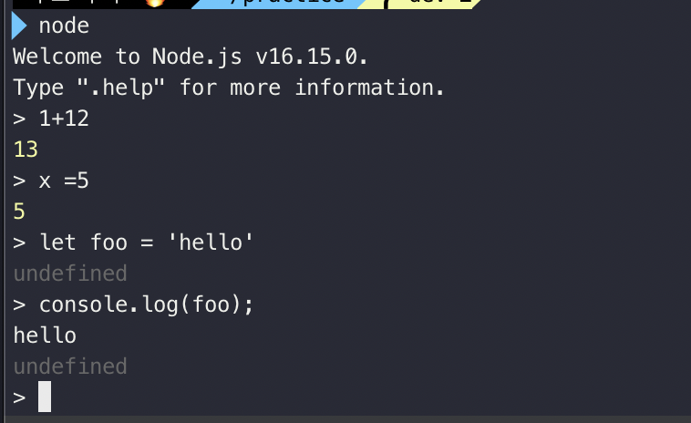

# 002 Node.js REPL로 코드 실행하기

- terminal에서 `node` 명령어 작성

### REPL이란?

- Read - Eval - Print - Loop의 약자
  - Read : 사용자의 명령어를 입력받으면 메모리에 JS 데이터 구조로 분석(Read)
  - Eval : 분석한 명령어를 내부 데이터 구조로 가져와 평가(Eval) -> 해당 명령어 실행
  - Print : 결과를 받아 출력(Print)
  - Loop : Print 완료후 다시 Read로 돌아감(Loop)
- 사용자가 입력한 결과를 바로 반환하는 대화형 shell 환경 의미
