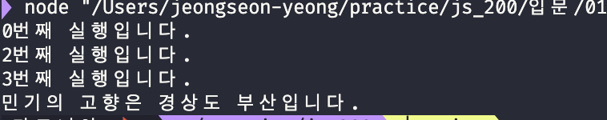

# 반복문 배우기 - for

- 반복문은 특정 코드를 반복하는 흐름을 제어함

```
for(초기값; 조건식; 어떤 간격인지){
    실행할 문장
}
```

- 첫번째 지시어 for로 인해 반복문이 시작됨

```
for(let i =0; i <10; i++){
    colsole.log(i+번째);
}
```

---

0번째
1번째...

---

- 0번 부터 시작함
- 10이 되면 종료
- i++(+1간격으로 진행됨)

e.g.
[여기 코드 참조](https://github.com/sunyeongjeong/js_200/blob/main/%EC%9E%85%EB%AC%B8/013.js)


